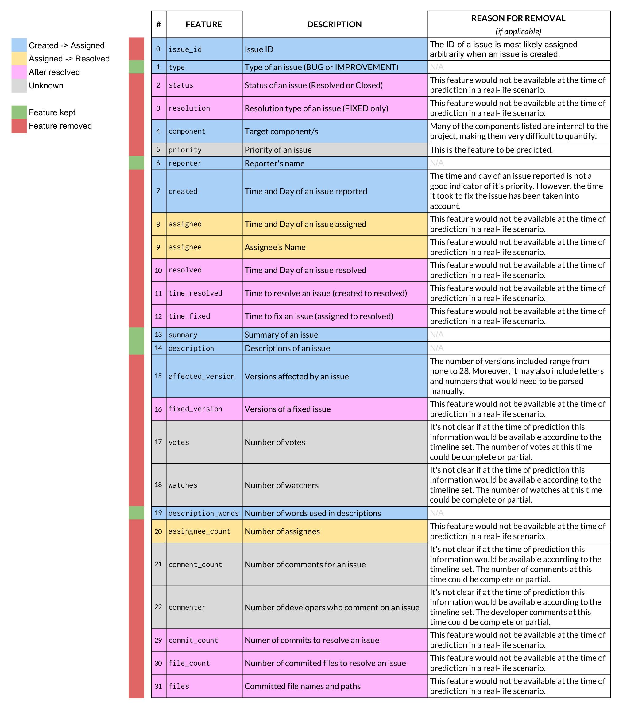

# $$Bug\space Priority\space Prediction$$

### $$ Luisa\space Rojas\space Garcia $$ $$ Alexandar\space Mihaylov $$ $$ CSCI\space 6100G $$

# Problem statement
Given any high impact bug, automatically identify its priority. 

# Introduction
Software development and maintenance is a very large factor in the success of demise of a software applications. As such developers heavily depend on other developers or users of the application to submit issues and bug reports. Fixing these issues and bugs is a long and extensive field of Software Engineering and many methods have been developed to aid the process from a bug being reported to resolved. In this work we hope to additionally aid the aforementioned process by automatically categorizing the bugs' priority into one of five categories:

The automatic categorization will be done with the aid of a deep neural network that has been trained on a dataset of 40 high impact bugs. The features were carefully selected and used to aid the neural network in predicting the priority of the high impact bug. Sentiment analysis will be applied on some of the features in order to quantify them and aid the neural network in predicting the priority. This work also determines the optimal number of hidden layers and their respective perceptron count and corresponding activation functions. Finally we perform analysis on the results and conclude that despite efforts to balance and optimize input features, the data does not hold significant enough information in order to adequately predict the priority of the bug.

# Motivation
Developer time is a commodity and should be utilized in order to optimize the development and maintenance of software. Bug priority categorization allows for improved delegation of bug resolution amongst developers of different expertise. Given a bug priority of critical, the bug can be delegated to the most experienced developer in order to most adequately deal with the resolution of the bug. Trivial bugs on the other hands can be handed down to developers with lesser experience, but should be resolved nonetheless. The overall goal is to save developer time in resolution of bugs the bug's priority. However if the bug's priority is to be manually discovered, which takes up developer time, then the whole process becomes counter intuitive since the overall goal was to save time. The key is that the discovery of a bug's priority should be done automatically, which if accurately done, directly improves the bug resolution pipeline without intro ducting any trade-off. [1](#test)

# Method
The work in this project can be summarized in the following steps:
1. Data Collection
2. Manual Feature Selection
3. Applying Sentiment Analysis on textual features
4. Applying selected features to a deep neural network
5. Handling Imbalanced Data
6. Optimizing the neural network 
7. Performing analysis
8. Conclusions
9. References

# 1. About the Data

Given any high impact bug, identify its priority.

Methods in research of Software Engineering focus on predicting, localizing, and triaging bugs, but do not consider their impact or weight on the users and on the developers.

For this reason, we want to distinguish different kinds of bugs by placing in them in different priority categories: **Critical**, **Blocker**, **Major**, **Minor**, **Trivial**.

Below are their definitions$^1$:

* Blocker: we can not move forward until this task completed or this bug fixed. Blocker JIRAs block the completion of a design or development iteration, or the releaseof the product.
    * development or design of a critical component or activity on the project can not move forward until this is resolved.
    * breaks the build process.
    * causes the UI to not start up or function at all.
    * renders an area of finished functionality unusable for most users.
    * not completed task which is needed for the kernel to function.
* Critical: this task or issue will most likely be resolved for release.
    * needed for the next iteration
    * major browser incompatibility
    * renders an isolated particular feature completely unusable
    * affects kernel - front-end communication
    * major accessibility issue
    * major security issue
* Major:(default) Issue should be resolved for release.
    * majority of bugs and tasks
    * if unsure, chose this
* Minor:issue might be resolved for release.
    * issues and bugs which can be fixed with entry level knowledge
    * does not affect functionality in any way, presentation may be broken
* Trivial: issue may or may not be resolved.
    * this should be for borderline tasks and issues. For that moment when you're not sure whether you should write something up or not.

# 1. Data Collection

We will work with a large dataset of high impact bugs, which was created by manually reviewing four thousand issue reports in four open source projects (Ambari, Camel, Derby and Wicket). The projects were extracted from JIRA, a platform for managing reported issues.

There are 1000 examples per project; there will be 4000 examples to work with in total.

These projects were selected because they met the following criteria for project selection:

* Target projects have a large number of (at least several thousand) reported issues , which enables the use for prediction model building and/or machine learning.

* Target projects use JIRA as an issue tracking system.

* Target projects are different from each other in application domains.

# 2. Manual Feature Selection

First, the most relevant features are selected manually. The original features included in the dataset were the following:

However, after careful consideration, only the following columns will be taken into account for further analysis:

# 3. Applying Sentiment Analysis on textual features

[SentiStrength](http://sentistrength.wlv.ac.uk) estimates the strength of positive and negative sentiment in short texts, even for informal language. It has human-level accuracy for short social web texts in English, except political texts. SentiStrength reports two sentiment strengths:

 
$-1$ *(not negative)* to $-5$ *(extremely negative)*

$1$ *(not positive)* to $5$ *(extremely positive)*
 

For this project, they will both be added in order to be used as a new column for data analysis.

# 4. Applying selected features to a deep neural network
# 5. Handling Imbalanced Data
# 6. Optimizing the neural network 
# 7. Performing analysis
# 7.1. Comparison with other papers

| Paper | Method |
|-------|--------|
| [Automated Identification of High Impact Bug Reports Leveraging Imbalanced Learning Strategies](http://ieeexplore.ieee.org.uproxy.library.dc-uoit.ca/stamp/stamp.jsp?arnumber=7552013&tag=1 "Paper") |  Naive Bayes Multinominal |

# 8. Conclusions
# 9. References
 Ohira, Masao, et al. "A dataset of high impact bugs: Manually-classified issue reports." Mining Software Repositories (MSR), 2015 IEEE/ACM 12th Working Conference on. IEEE, 2015.

## Dependencies

* `python 3`
* `tensorflow`: [Installation](https://www.tensorflow.org/install/)
*  `pandas`: [Installation](https://pandas.pydata.org/pandas-docs/stable/install.html)
*  `numpy`: [Installation](https://www.scipy.org/scipylib/download.html)
* `scikit-learn` [Installation](http://scikit-learn.org/stable/install.html)
* `imblearn`: [Installation](http://contrib.scikit-learn.org/imbalanced-learn/stable/install.html)

## Work or Limits:

The Sentiment Analysis may not take into account technical terms, giving them scores that are not accurate.

## Imbalanced Data
	
* The model seems to learn to always guess the priority category with the highest percentage - usually "Major". This causes the accuracy to always be as good as the percentage of this category in the data (labels).

	* This was observed when the model was ran for all of the data combined, as well as for each specific project being worked with.

	* In order to deal with the imbalanced data, we used the following library: http://contrib.scikit-learn.org/imbalanced-learn/stable/over_sampling.html. There are three different approaches that were tested:

		[] Naive random over-sampling
		
		[] Synthetic Minority Oversampling Technique (SMOTE)
		
		[] Adaptive Synthetic (ADASYN)
		
		* TEST RUN RESULTS
		
		Using 0.01 learning rate, 10,000 epochs, 10 perceptrons (1 layer):
		
		* **Naive**: accuracy = 20.7% (*ran once*)
		* **Smote**: accuracy = 25.28205% (*ran once*)
		* **Adasyn**: 20.56663% (*ran once*)

## Features for best results

### Identifying the best features

Original features: `type`, `reporter`, `summary`, `description `, `description_words`

Using 0.01 learning rate, 10,000 epochs, 10 perceptrons (1 layer), and NAIVE for data balancing:

#### Using 4 Features

| Features Used | Accuracy |
|---------------|----------|
| `reporter`, `summary`, `description`, `description_words` | 20.30769% |
| `type`, `summary`, `description`, `description_words` | 23.33333% |
| `type`, `reporter`, `description`, `description_words` | 20.10256% |
| `type`, `reporter`, `summary`, `description_words` | 21.46154% |
| `type`, `reporter`, `summary`, `description` | 20.00000% |

#### Using 3 Features

| Features Used | Accuracy |
|---------------|----------|
| `summary`, `description`, `description_words` | 20.41026% |
| `reporter`, `description`, `description_words` |20.00000% |
| `reporter`, `summary`, `description_words` | 20.00000% |
| `reporter`, `summary`, `description` | 20.00000% |
| `type`, `description`, `description_words` | 20.00000% |
| `type`,`summary`, `description_words` | 20.00000% |
| `type`, `summary`, `description` | 32.69231% |
| `type`, `reporter`, `description_words` | 19.74359% |
| `type`, `reporter`, `description ` | 22.48718% |
| `type`, `reporter`, `summary` | 20.07692% |

#### Using 2 Features

| Features Used | Accuracy |
|---------------|----------|
| `description`, `description_words` | 20.00000% |
| `summary`, `description_words` | 21.12820% |
| `summary`, `description` | 21.61538% |
| `reporter`, `description_words` | 20.82051% |
| `reporter`, `description` | 20.02564% |
| `reporter`, `summary` | 20.00000% |
| `type`, `description_words` | 20.33333% |
| `type`, `description` | 32.64103% |
| `type`, `summary` | 27.84615% |
| `type`, `reporter` | 20.33333% |

#### Using 1 Feature

| Features Used | Accuracy |
|---------------|----------|
| `type` | 28.61539% |
| `reporter` | 20.10256% |
| `summary` | 20.84615% |
| `description` | 20.41026% |
| `description_words` | 20.00000% |

According to the data collected above, the feature combinations that achieved the highest accuracy score are shown below. These were selected to also be ran using three different balancing data appraoches:

| Ranking | Features Used | Accuracy (NAIVE) | Accuracy (SMOTE) | Accuracy (ADASYN) | Average Accuracy |
|:-------:|---------------|:--------:|:--------:|:--------:|:-------:|
| 1 | `type`, `summary`, `description` | 32.69231% | 31.84615% | 24.32361% | 29.62069% |
| 2 | `type`, `description` | 32.64103% | 31.84615% | 22.20551% | 28.897563%
| 3 | `type` | 28.61539% | 28.38461% | 24.61696% | 27.205653% |
| 4 | `type`, `summary` | 27.84615% | 32.33333% | 26.01171% | 28.730397% |
| 5 | `type`, `summary`, `description`, `description_words` | 23.33333% | 20.20513% | 20.60197% | 21.380143% |

After running those with the three balancing data approaches and calculating their corresponding accuracies, the new ranking is the following:

| Ranking | Features Used | Accuracy (NAIVE) | Accuracy (SMOTE) | Accuracy (ADASYN) | Average Accuracy |
|:-------:|---------------|:--------:|:--------:|:--------:|:-------:|
| 1 | `type`, `summary`, `description` | 32.69231% | 31.84615% | 24.32361% | 29.62069% |
| 2 | `type`, `description` | 32.64103% | 31.84615% | 22.20551% | 28.897563%
| &uarr; 3 | `type`, `summary` | 27.84615% | 32.33333% | 26.01171% | 28.730397% |
| &darr; 4 | `type` | 28.61539% | 28.38461% | 24.61696% | 27.205653% |
| 5 | `type`, `summary`, `description`, `description_words` | 23.33333% | 20.20513% | 20.60197% | 21.380143% |

Even though both the Naive and SMOTE approaches show excellent results, SMOTE will be used for the next calculations.
This is because previous to feature manipulation, SMOTE achieved the highest accuracy score (25.28205%) - using all the features in the dataset.

## Automatically identifying the most influential features

## Recall, Precision, and F1

# References

1: https://confluence.ets.berkeley.edu/confluence/display/MYB/JIRA%2C+Definitions

[Imbalanced-learn: Over Sampling](http://contrib.scikit-learn.org/imbalanced-learn/stable/over_sampling.html)